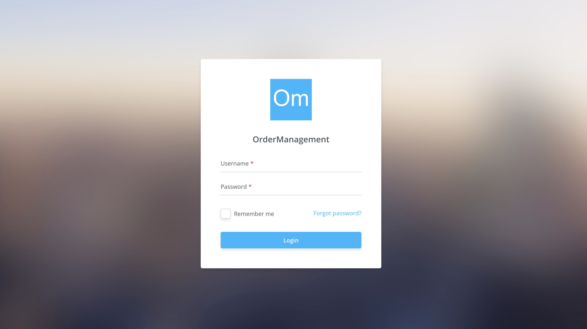
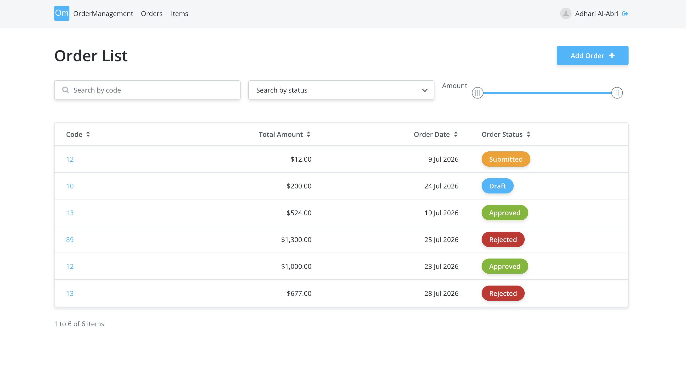
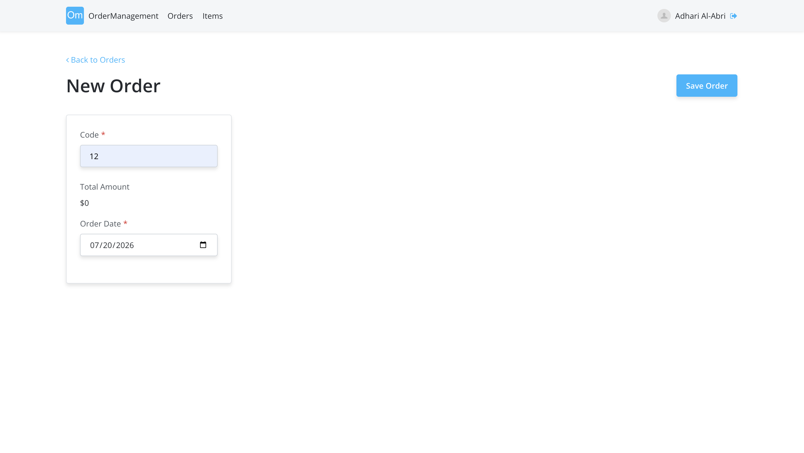
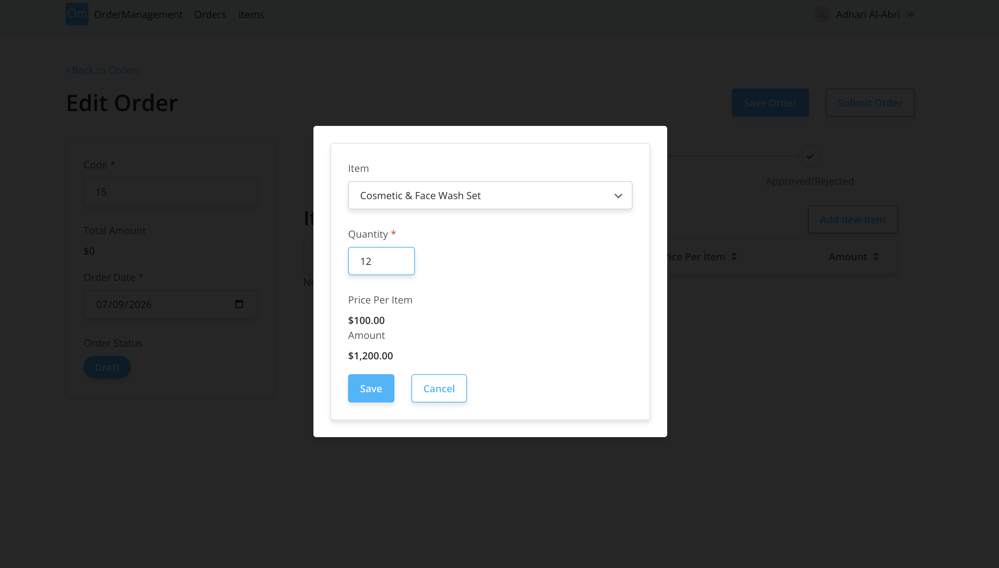
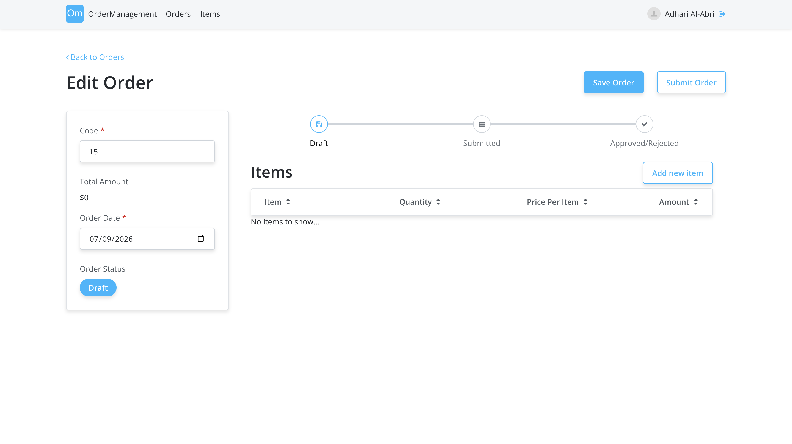
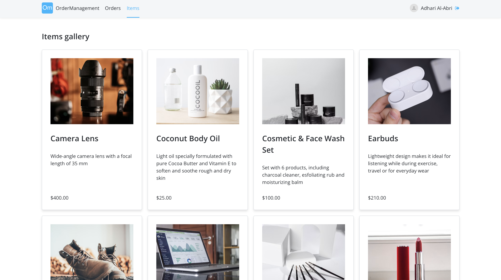
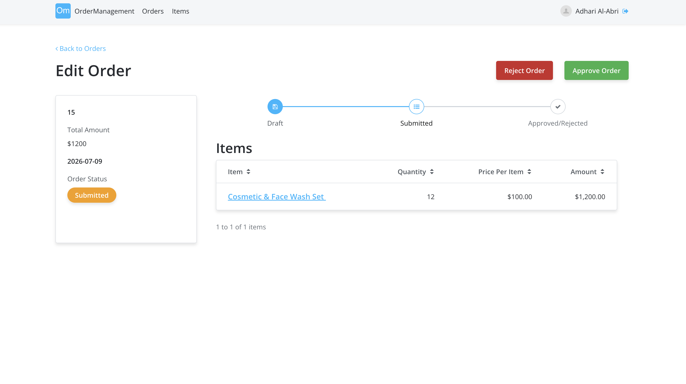

# Order Management System

A simple **Order Management System** built using **OutSystems**. The application allows users to create, manage, and submit orders while automatically calculating the total amount based on the selected items.

---

## Website URL

**https://personal-aj6wpmjr.outsystemscloud.com/OrderManagement/Login**

---

## Login Credentials

| Username | Password | Role |
|----------|----------|------|
| user123 | user1234 | User |

---

## Features

### Authentication
- User login
- Secure logout

### Order Management
- Create a new order
- Edit existing orders
- Save orders as **Draft**
- Submit orders for approval
- Approve or reject submitted orders
- View order status (Draft, Submitted, Approved, Rejected)

### Item Management
- Browse available products from the Item Gallery
- Add multiple items to an order
- Specify quantities
- Automatically calculate:
  - Price per item
  - Item amount
  - Total order amount

### search & Filtering
- Search orders by order code
- Filter orders by status
- Filter orders using the amount slider
- Sort table columns

---

# How to Use

## 1. Login

Open the application and login using your credentials.

---

## 2. View Orders

The Orders page displays all existing orders.

Features include:

- Search by Order Code
- Filter by Status
- Filter by Amount
- View Order Status
- Create New Order

---

## 3. Create a New Order

Click **Add Order** to create a new order.

Provide:

- Order Code
- Order Date

The total amount is automatically updated after adding items.

---

## 4. Add Items

Click **Add New Item**.

Select:

- Item
- Quantity

The system automatically calculates:

- Price per Item
- Item Amount

Click **Save** to add the item to the order.

---

## 5. Edit Orders

Users can:

- Update order details
- Modify item quantities
- Add additional items
- View updated totals

---

## 6. Browse Items

Users can browse available products from the gallery before adding them to an order.

---

## 7. Submit, Approve or Reject Orders

Once an order has been completed, it can be submitted.

Submitted orders can then be:

- Approved
- Rejected

The order status updates automatically.

---

# Future Improvements

- Email notifications
- Dashboard with analytics
- Export orders to PDF/Excel

---

## Author

**Adhari Al-Abri**
